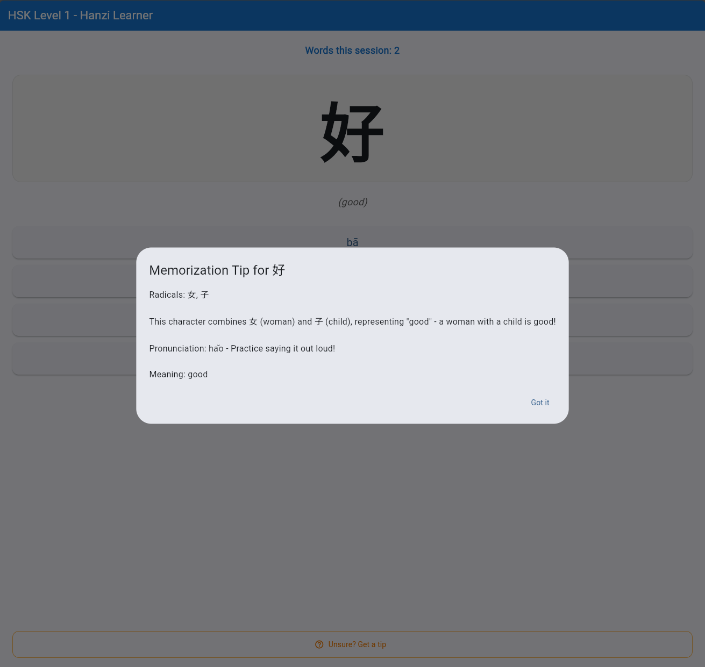

# What is this app?
This (WIP) app is aimed for those can speak Chinese but have lost the ability to read or write. It focuses only on the vocabulary based on the HSK 3.0 (1-7+) levels and contains useful tips on how to memorise them. By default, each session is designed to make you learn around 5 new Hanzi.

# What about other apps?
While most other apps are more feature rich, sometimes these features like pronounciation and additional context allows you to select the correct answer without actually knowing the word. Additionally, some flashcard apps do not provide a hints feature for you to properly memorise a character.

# Roadmap
The free version will allow a user to learn characters completely offline and progress is stored on the local device. This is a Flutter app so it is cross-platform and should work on browsers, Android and Apple devices. There will not be any Ads at this time.

I plan to implement a paid version that allows premium users to save their progress on the cloud and create discussion threads on each character they come across. The payment will be paying for the costs that these services require.

# What it will kind of look like
